# FishGo

## 목차

- [개요](#개요)
- [기능](#기능)
- [유사 서비스](#유사-서비스) 
- [향후 전망](#향후-전망)
- [기술 스택](#기술-스택)
- [기술 설명](#기술-설명)
  - [ERD](#erd)
  - [디렉토리 구조도](#디렉토리-구조도)
  - [시스템 구성도](#시스템-구성도)
  
  

## 개요

### 기간

2020.10~ 2020.11 (약 4주)


### 목적

- 낚시된 물고기 사진을 찍으면 물고기 정보를 알려주는 모바일 앱 구현

- 사진과 낚시된 물고기에 대한 정보 기록으로 자신만의 낚시 히스토리 생성
- 지도 상에서 어종별 낚시터와 낚시 밀도 등에 대한 정보 제공


### 역할 및 기여도

- 팀원: 5명

- 역할: 백엔드 (팀원)

- 기여도: 약 20%
  - REST API 구축
  - 데이터 크롤링


## 주요 기능

1. 로그인 페이지

   - 일반 로그인

   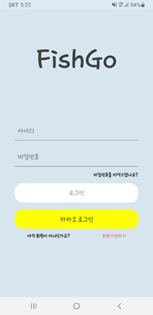

   

   - 카카오 로그인

   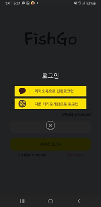

   

   - 비밀번호 변경 페이지

   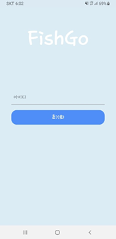


2. 회원가입 페이지

   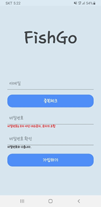

   - 아이디 중복

   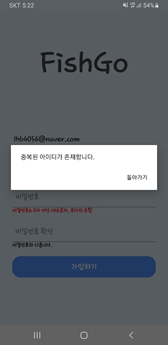

   

   - 비밀번호 유효성

   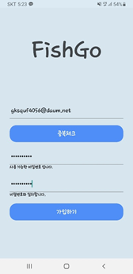

   

   - 이메일 확인 알림

   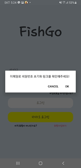


3. 메인페이지

   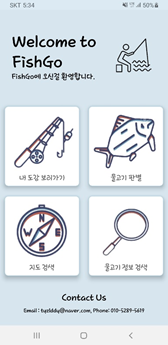


4. 도감 페이지

   - 잡은 기록이 있는 물고기는 색이 있고, 잡아본 적 없는 물고기는 그림자로 표현

   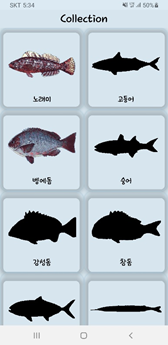

   

   - 상세 페이지

   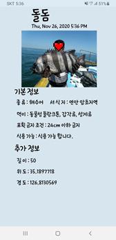


5. 물고기 판별

   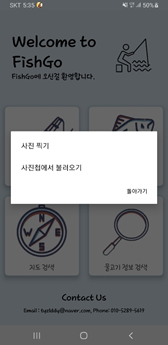

   

   - 판별 결과, 여러 옵션 중 선택 가능(유사도 높은 순으로 정렬)

   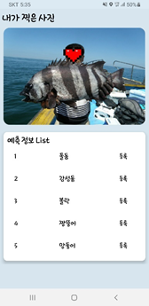

   

   - 해당 물고기 정보를 히스토리에 등록 가능

   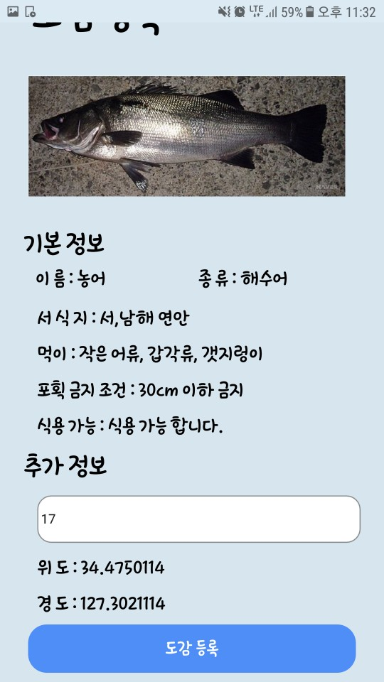


6. 낚시 정보 제공

   - 유저들이 잡은 물고기 어종별 포인트 검색 기능

   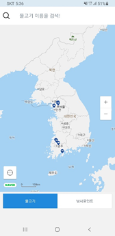

   

   - 어종별 낚시 포인트 검색 기능

   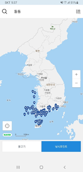

   

   - 포인트 선택 시, 주소 정보 제공

   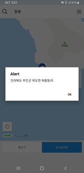


7. 물고기 정보 검색 기능

   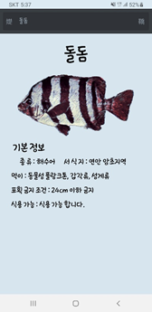


## 유사 서비스

1. Fish brain

   - SNS로 정보 제공

   - 상호 낚시꾼들 간 정보 교환이 목적

     

2. Fish verify  
   - 물고기를 인식하여 길이와 정보를 보여주는 AI 서비스
   - 해외 어종에 대한 정보만을 제공


## 향후 전망

1. 랭킹
   - 어플 사용의 흥미를 더해주기 위하여 낚시 랭킹 시스템 도입 필요


## 기술 스택

- Front-end: React Native, Android Studio, MobX
- Back-end: Django, Tenserflow, AWS(EC2)
- DB: Sqlite3


## 기술 설명

### ERD

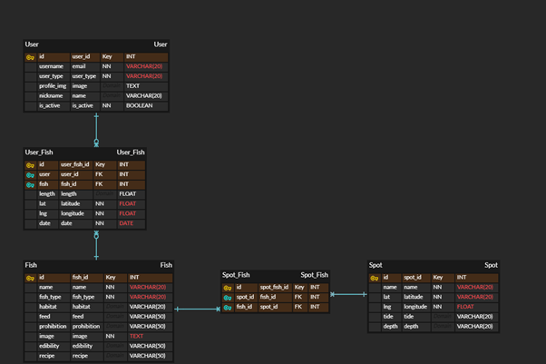


### 디렉토리 구조도

- 프론트엔드


- 백엔드

    ```
    ROOT
    ├── accounts
    │   ├── migrations
    │   │   └── __init__.py
    │   ├── templates
    │   │   ├── accounts
    │   │   │   ├── auth.html 
    │   │   │   ├── password_reset_complete.html 
    │   │   │   └── password_reset_confirm.html  
    │   │   └── base.html
    │   ├── __init__.py
    │   ├── admin.py
    │   ├── apps.py
    │   ├── email_text.py
    │   ├── forms.py
    │   ├── models.py
    │   ├── serializers.py
    │   ├── token.py
    │   ├── views.py
    │   ├── urls.py
    │   └── tests.py
    ├── api
    │   ├── files
    │   │   ├── fish_inception_v2_graph
    │   │   └── fish_label_map.pbtxt
    │   ├── fixtures
    │   │   └── all_webtoon_rank.json
    │   ├── migrations
    │   │   └── __init__.py
    │   ├── __init__.py
    │   ├── admin.py
    │   ├── apps.py
    │   ├── models.py
    │   ├── serializers.py
    │   ├── tests.py
    │   ├── views.py
    │   └── urls.py
    ├── backend
    │   ├── __init__.py
    │   ├── asgi.py
    │   ├── settings.py
    │   ├── urls.py
    │   └── wsgi.py
    ├── models
    ├── .gitignore
    ├── manage.py
    └── requirements.txt
    ```


### 시스템 구성도

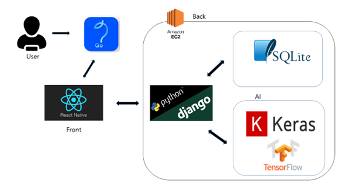